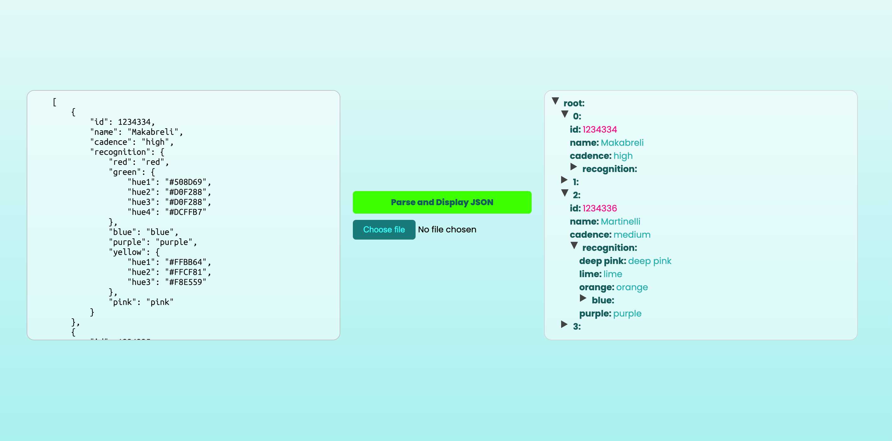

# JSON-Viewer

Parses any valid json-file and builds up a tree to make your string user-friendly to read.


## Installation

1. Clone the repository:
   ```bash
   git clone https://github.com/tpreisig/json-reader.git
   ```
2. Navigate to the project directory:
   ```bash
   cd json-reader
   ```
3. Start the application:
   ```bash
   open index.html
   ```
   
## License
This project is licensed under the MIT License - see the [LICENSE](LICENSE) file for details.

## Screenshots


## Contact
Maintained by tpreisig - feel free to reach out!